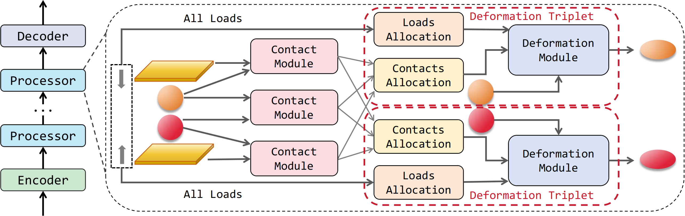
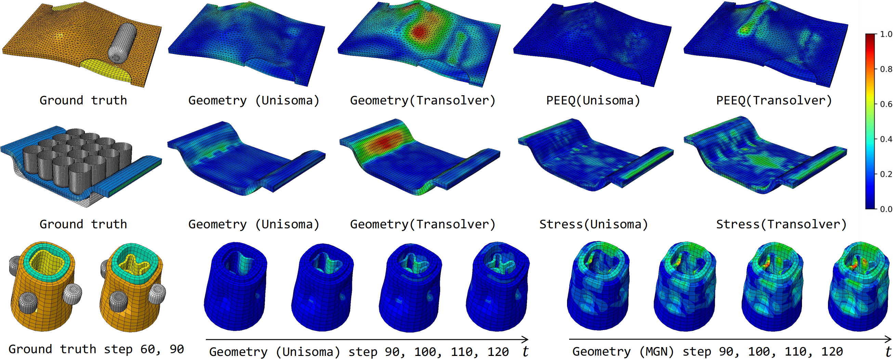
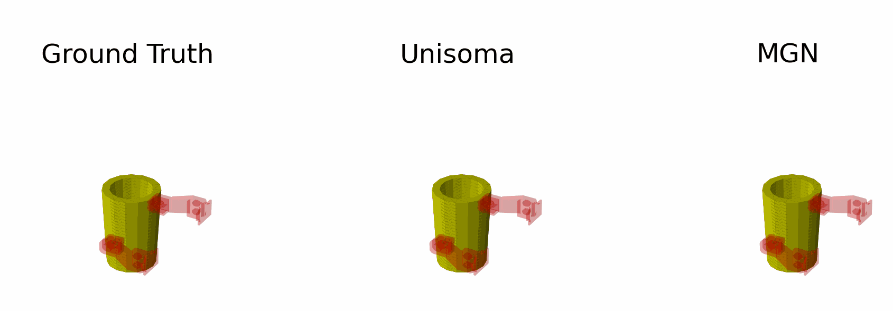
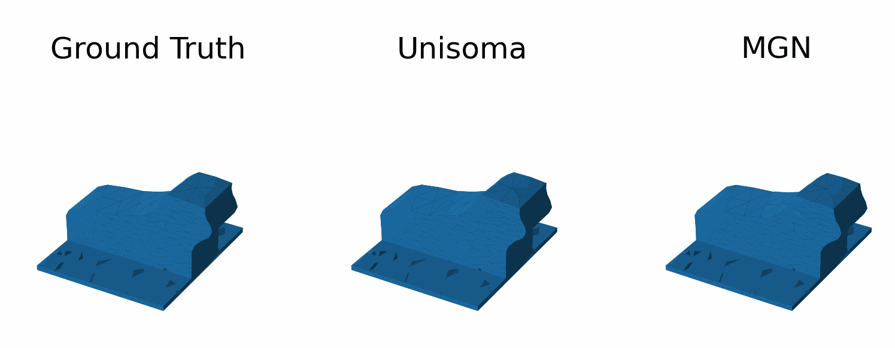

# Unisoma (ICML 2025)

Code for "Unisoma: A Unified Transformer-based Solver for Multi-Solid Systems", accepted at International Conference on Machine Learning (ICML 2025).



## Usage

### Install Python and Dependencies.

1. We recommend `Python 3.10`, `Pytorch 2.5.0`.

2. Install `torch_geometric` following the [official repo](https://github.com/pyg-team/pytorch_geometric).

3. Install other dependencies by:

```
pip install -r requirements.txt
```

### Prepare Data

You can download preprocessed public dataset from this [link](https://drive.google.com/drive/folders/1bYeYYsOnBgxujN7mv8Lx8YILykc6GzY-?usp=sharing) and our created dataset from this [link](https://disk.pku.edu.cn/link/AA70C3D42902954D1798DCD62CD4DB3C79).

- Except for the Tissue Manipulation dataset, we preprocess other public datasets. You can download Tissue Manipulation dataset in [GGNS repo](https://github.com/jlinki/GGNS). 

- We provide self-curated datasets as well as certain preprocessed public datasets. If any copyright infringement is identified, please contact us at shilongtao@stu.pku.edu.cn, and we will address the issue promptly.

~~**\*\*\*** Update on 2025.08.20. So far, we have uploaded the public datasets used in the paper, including Cavity Grasping, Deforming Plate, and Rice Grip. The other datasets we created in this work are part of our ongoing project and are currently under internal review and sensitive information screening, so they cannot be made publicly available at this moment. We will release them **no later than October of this year**. Thank you for your understanding.~~

**\*\*\*** Update on 2025.10.23. We have uploaded all dataset used in the paper.

- The dataset should put in `input` folder with following file structure. Take `bilateral_stamping` as an example:

```
root_folder/
└──  bilateral_stamping/
    ├── assets/
    |   ├──checkpoints             # save model weight
    |   ├──logs                    # save training and test logs
    |   └──normalizers             # save normalizers
    └── data/          
        ├──input                   # save dataset
        └──ret                     # save prediction results
```

- Then modify the path of `assets` and `data` in the `xxx.toml`, where `xxx` indicates the dataset name.

### Train, Evaluation and Test

```
# Run in foreground
python exp_xxx.py

# Run in background
setsid python -u exp_xxx.py & 
```

- You can use the default config in the `configs` folder to reproduce the experiment results. And you can also explore more by modifying the configs.

- The output log is placed in the `logs` folder.

## Visualization

### Visualization of error maps



### Cavity Extruding rollout


### Cavity Grasping rollout



### Tissue Manipulation rollout




## Contact

Any further questions, please contact shilongtao@stu.pku.edu.cn.

## Citation

If you find this repo useful for you, please consider citing the following paper:

```
@inproceedings{tao2025unisoma,
  title={Unisoma: A Unified Transformer-based Solver for Multi-Solid Systems},
  author={Tao, Shilong and Feng, Zhe and Sun, Haonan and Zhu, Zhanxing and Liu, Yunhuai},
  booktitle={Forty-second International Conference on Machine Learning},
  year={2025}
}

@inproceedings{tao2025ladeep,
  title={LaDEEP: A Deep Learning-based Surrogate Model for Large Deformation of Elastic-Plastic Solids},
  author={Tao, Shilong and Feng, Zhe and Sun, Haonan and Zhu, Zhanxing and Liu, Yunhuai},
  booktitle={Proceedings of the 31st ACM SIGKDD Conference on Knowledge Discovery and Data Mining V.2},
  year={2025}
}

```

## Acknowledgement

We sincerely appreciate the following repos for their code and dataset: 

- [Meshgraphnets](https://github.com/google-deepmind/deepmind-research/tree/master/meshgraphnets)

- [GGNS](https://github.com/jlinki/GGNS)

- [DPI-Net](https://github.com/YunzhuLi/DPI-Net)

- [Neuraloperator](https://github.com/neuraloperator/neuraloperator)

- [Geo-FNO](https://github.com/neuraloperator/Geo-FNO)

- [Transolver](https://github.com/thuml/Transolver/tree/main)